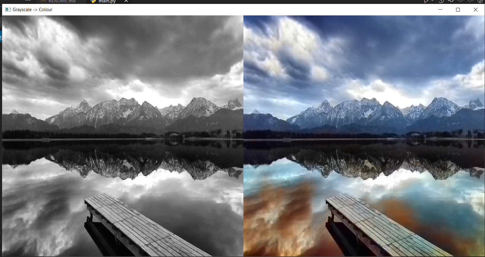

# Black-White-Image-Colourizer
Our aim here is to create a program to convert a gray scale image to a colourized image using Deep learning, and CNNs to be specific.

# Working: 

# Sources/Mentions/Resources
The technique we’ll be covering here today is from Zhang et al.’s 2016 ECCV paper, [Colorful Image Colorization](http://richzhang.github.io/colorization/).

Implementation was using this blog post as inspiration: 
https://pyimagesearch.com/2019/02/25/black-and-white-image-colorization-with-opencv-and-deep-learning/

Downloading the model files: https://drive.google.com/drive/folders/1FaDajjtAsntF_Sw5gqF0WyakviA5l8-a?usp=sharing

## Connect With Me:
*Yagyesh Bobde*  

  
  